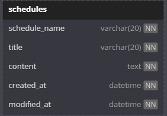

Lv 0 API 명세 및 ERD 작성 - API 명세서

## ERD 다이어그램


## 일정 생성
| 항목         | 내용                           |
|--------------|--------------------------------|
| **Method**   | `POST`                         |
| **URL**      | `{{url}}/api/schedule`         |
| **설명**     | 새로운 일정을 등록합니다.       |
| **Request Body** | JSON (application/json)     |

### 자료형
| 필드명        | 타입     | 필수 | 설명         |
|---------------|----------|----|--------------|
| member_name   | String   | O  | 작성자 이름   |
| title         | String   | O  | 일정 제목     |
| content       | String   | O  | 일정 내용     |

### 요청
```json
{
  "member_name": "홍길동",
  "title": "과제",
  "content": "스프링 복습"
}
```

### 응답
```json
{
  "member_name": "홍길동",
  "title": "과제",
  "content": "스프링 복습",
  "created_at": "2025-04-01",
  "modified_at": "2025-04-01"
}
```
### 상태코드
| 코드  | 설명              |
| --- | --------------- |
| 200 | 일정 생성 성공        |
| 400 | 필드 누락 또는 유효성 실패 |
| 500 | 서버 내부 오류        |

---
## 일정 조회 (사용자 이름 기반)
| 항목         | 내용                                            |
|--------------|-------------------------------------------------|
| **Method**   | `GET`                                           |
| **URL**      | `{{url}}/api/schedule?username=홍길동`          |
| **설명**     | `username`에 해당하는 사용자의 일정을 조회합니다. |
| **Request Params** | Query String (`username`)                |

### 자료형
| 필드명     | 타입     | 필수 | 설명               |
|------------|----------|------|--------------------|
| username   | String   | O    | 조회할 사용자 이름   |

### 요청 예시
GET /api/schedule?username=홍길동

### 응답 예시
```json
[
  {
    "member_name": "홍길동",
    "title": "과제",
    "content": "스프링 복습",
    "created_at": "2025-04-01",
    "modified_at": "2025-04-01"
  },
  {
    "member_name": "홍길동",
    "title": "스터디",
    "content": "자바 기초",
    "created_at": "2025-04-02",
    "modified_at": "2025-04-02"
  }
]
```
### 상태코드
| 코드  | 설명                     |
| --- | ---------------------- |
| 200 | 일정 조회 성공               |
| 400 | `username` 누락 등 잘못된 요청 |
| 404 | 해당 사용자의 일정 없음          |
| 500 | 서버 내부 오류               |

---
## 일정 수정
| 항목         | 내용                                             |
|--------------|--------------------------------------------------|
| **Method**   | `PUT`                                            |
| **URL**      | `{{url}}/api/schedule`                           |
| **설명**     | `member_name`와 `title`에 해당하는 일정을 수정합니다. |
| **Request Body** | JSON (application/json)                     |

### 자료형
| 필드명       | 타입     | 필수 | 설명                        |
|--------------|----------|------|-----------------------------|
| member_name  | String   | O    | 작성자 이름 (수정 대상 기준) |
| title        | String   | O    | 일정 제목 (수정 대상 기준)   |
| content      | String   | O    | 새로 수정할 일정 내용         |

### 요청
```json
{
  "member_name": "홍길동",
  "title": "과제",
  "content": "스프링 복습 완료 및 발표 준비"
}
```
### 응답
```json
{
  "member_name": "홍길동",
  "title": "과제",
  "content": "스프링 복습 완료 및 발표 준비",
  "created_at": "2025-04-01",
  "modified_at": "2025-04-03"
}
```

### 상태코드
| 코드  | 설명              |
| --- | --------------- |
| 200 | 일정 수정 성공        |
| 400 | 필드 누락 또는 유효성 실패 |
| 404 | 대상 일정이 존재하지 않음  |
| 500 | 서버 내부 오류        |

---
## 일정 삭제
| 항목         | 내용                                              |
|--------------|---------------------------------------------------|
| **Method**   | `DELETE`                                          |
| **URL**      | `{{url}}/api/schedule`                            |
| **설명**     | `member_name`와 `title`에 해당하는 일정을 삭제합니다. |
| **Request Body** | JSON (application/json)                      |

### 자료형
| 필드명       | 타입     | 필수 | 설명                        |
|--------------|----------|------|-----------------------------|
| member_name  | String   | O    | 작성자 이름 (삭제 대상 기준) |
| title        | String   | O    | 일정 제목 (삭제 대상 기준)   |

### 요청
```json
{
  "member_name": "홍길동",
  "title": "과제"
}
```
### 응답
```json
{
  "message": "일정이 성공적으로 삭제되었습니다."
}
```
### 상태코드
| 코드  | 설명              |
| --- | --------------- |
| 200 | 일정 삭제 성공        |
| 400 | 필드 누락 또는 유효성 실패 |
| 404 | 대상 일정이 존재하지 않음  |
| 500 | 서버 내부 오류        |

