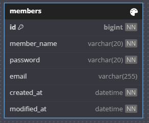

Lv 2 회원 API 명세서

## ERD 다이어그램


---
## 회원 생성 (회원가입)

| 항목             | 내용                             |
|------------------|--------------------------------|
| **Method**       | `POST`                         |
| **URL**          | `{{url}}/api/members/register` |
| **설명**         | 새로운 회원을 등록합니다.                 |
| **Request Body** | JSON (application/json)        |

### 자료형

| 필드명         | 타입     | 필수 | 설명      |
|-------------|----------|----|---------|
| member_name | String   | O  | 회원 이름   |
| email       | String   | O  | 회원 이메일  |
| password    | String   | O  | 회원 비밀번호 |

### 요청 예시
```json
{
  "member_name": "홍길동",
  "email": "abc@gmail.com",
  "password": "abcd"
}
```
### 응답 예시
```json
{
  "id": 1,
  "member_name": "홍길동",
  "email": "abc@gmail.com",
  "create_at": "2025-05-21T04:27:26.942+00:00",
  "modified_at": "2025-05-21T04:27:26.942+00:00"
}
```
### 상태코드
| 코드  | 설명          |
| --- | ----------- |
| 200 | 회원 목록 조회 성공 |
| 500 | 서버 내부 오류    |

---
## 회원 조회(단건)

| 항목                 | 내용                         |
| ------------------ | -------------------------- |
| **Method**         | `GET`                      |
| **URL**            | `{{url}}/api/members?id=1` |
| **설명**             | ID에 해당하는 회원 정보를 조회합니다.     |
| **Request Params** | Query String (`id`)        |


### 자료형
| 필드명 | 타입   | 필수 | 설명        |
| --- | ---- | -- | --------- |
| id  | Long | O  | 조회할 회원 ID |

### 요청 예시
```
    GET /api/members?id=1
```
### 응답 예시
```json
{
  "id": 1,
  "member_name": "홍길동",
  "email": "1234@gmail.com",
  "createAt": "2025-05-17T07:23:36.864+00:00",
  "modifiedAt": "2025-05-17T07:23:36.864+00:00"
}
```
### 상태코드
| 코드  | 설명         |
| --- | ---------- |
| 200 | 회원 조회 성공   |
| 400 | 요청 파라미터 오류 |
| 404 | 해당 회원 없음   |
| 500 | 서버 내부 오류   |
---
## 회원 조회(전체)
| 항목                 | 내용                        |
| ------------------ | ------------------------- |
| **Method**         | `GET`                     |
| **URL**            | `{{url}}/api/members/all` |
| **설명**             | 전체 회원 목록을 조회합니다.          |
| **Request Params** | 없음                        |

### 요청 예시
```
    GET /api/members/all
```
### 응답 예시
```json
[
  {
    "id": 1,
    "member_name": "홍길동",
    "email": "1234@gmail.com",
    "createAt": "2025-05-17T07:23:36.864+00:00",
    "modifiedAt": "2025-05-17T07:23:36.864+00:00"
  },
  {
    "id": 2,
    "member_name": "홍길동2",
    "email": "hong@naver.com",
    "createAt": "2025-05-17T08:00:01.000+00:00",
    "modifiedAt": "2025-05-17T08:00:01.000+00:00"
  }
]

```
### 상태코드
| 코드  | 설명          |
| --- | ----------- |
| 200 | 회원 목록 조회 성공 |
| 500 | 서버 내부 오류    |

---
## 회원 수정 (이름 수정)
| 항목               | 내용                      |
| ---------------- | ----------------------- |
| **Method**       | `PUT`                   |
| **URL**          | `{{url}}/api/members`   |
| **설명**           | ID에 해당하는 회원의 이름을 수정합니다. |
| **Request Body** | JSON (application/json) |


### 자료형
| 필드명          | 타입     | 필수 | 설명        |
| ------------ | ------ | -- | --------- |
| id           | Long   | O  | 수정할 회원 ID |
| member\_name | String | O  | 새로 수정할 이름 |

### 요청 예시
```json
{
  "id": 1,
  "member_name": "홍길은"
}
```
### 응답 예시
```json
{
  "id": 1,
  "member_name": "홍길은",
  "email": "1234@gmail.com",
  "createAt": "2025-05-17T07:23:36.864+00:00",
  "modifiedAt": "2025-05-17T09:00:00.000+00:00"
}

```
### 상태코드
| 코드  | 설명              |
| --- | --------------- |
| 200 | 회원 이름 수정 성공     |
| 400 | 필드 누락 또는 유효성 실패 |
| 404 | 대상 회원 없음        |
| 500 | 서버 내부 오류        |

---
## 회원 삭제
| 항목               | 내용                      |
| ---------------- | ----------------------- |
| **Method**       | `DELETE`                |
| **URL**          | `{{url}}/api/members`   |
| **설명**           | ID에 해당하는 회원을 삭제합니다.     |
| **Request Body** | JSON (application/json) |


### 자료형
| 필드명 | 타입   | 필수 | 설명        |
| --- | ---- | -- | --------- |
| id  | Long | O  | 삭제할 회원 ID |


### 요청 예시
```json
{
  "id": 1
}

```
### 응답 예시
```json
{
  "message": ""
}
```
### 상태코드
| 코드  | 설명              |
| --- | --------------- |
| 200 | 회원 삭제 성공        |
| 400 | 필드 누락 또는 유효성 실패 |
| 404 | 대상 회원 없음        |
| 500 | 서버 내부 오류        |
