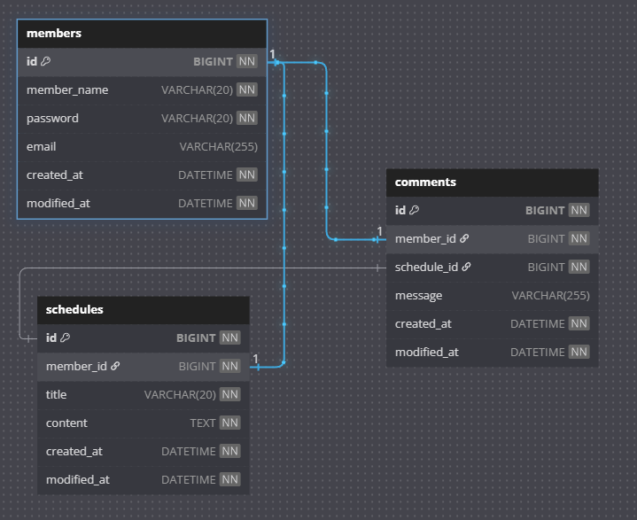

Lv 7 댓글 API 명세서

## ERD 다이어그램


---
## 댓글 생성

| 항목             | 내용                     |
|------------------|------------------------|
| **Method**       | `POST`                 |
| **URL**          | `{{url}}/comment `     |
| **설명**         | 새로운 댓글을 등록합니다.         |
| **Request Body** | JSON (application/json) |

### 자료형

| 필드명         | 타입     | 필수 | 설명    |
|-------------|--------|----|-------|
| schedule_id | Long   | O  | 일정 번호 |
| schedule_id | Long   | O  | 회원 번호 |
| message     | String | O  | 댓글    |

### 요청 예시
```json
{
  "schedule_id": 1,
  "member_id": 1,
  "message": "내용"
}
```
### 응답 예시
```json
{
  "id": 1,
  "schedule_id": 1,
  "member_id": 1,
  "message": "내용",
  "createAt": "2025-05-20T04:51:58.420+00:00",
  "modifiedAt": "2025-05-20T04:51:58.420+00:00"
}
```
### 상태코드
| 코드  | 설명          |
| --- | ----------- |
| 200 | 회원 목록 조회 성공 |
| 500 | 서버 내부 오류    |

---
## 댓글 조회 ( 일정 번호 기준 )

| 항목                 | 내용                              |
| ------------------ |---------------------------------|
| **Method**         | `GET`                           |
| **URL**            | `{{url}}/comment/schedule?id=1` |
| **설명**             | ID에 해당하는 댓글 정보를 조회합니다.          |
| **Request Params** | Query String (`id`)             |


### 자료형
| 필드명 | 타입   | 필수 | 설명        |
| --- | ---- | -- |-----------|
| id  | Long | O  | 조회할 일정 ID |

### 요청 예시
```
    GET /comment/schedule?id=1
```
### 응답 예시
```json
[
  {
    "id": 1,
    "schedule_id": 1,
    "member_id": 1,
    "message": "홍길은",
    "createAt": "2025-05-20T04:48:32.481+00:00",
    "modifiedAt": "2025-05-20T04:48:39.063+00:00"
  },
  {
    "id": 2,
    "schedule_id": 1,
    "member_id": 1,
    "message": "홍길길",
    "createAt": "2025-05-20T04:48:32.481+00:00",
    "modifiedAt": "2025-05-20T04:48:39.063+00:00"
  }
]
```
### 상태코드
| 코드  | 설명         |
| --- |------------|
| 200 | 댓글 조회 성공   |
| 400 | 요청 파라미터 오류 |
| 500 | 서버 내부 오류   |
---
## 댓글 조회 ( 회원 번호 기준 )

| 항목                 | 내용                            |
| ------------------ |-------------------------------|
| **Method**         | `GET`                         |
| **URL**            | `{{url}}/comment/member?id=1` |
| **설명**             | ID에 해당하는 댓글 정보를 조회합니다.        |
| **Request Params** | Query String (`id`)           |


### 자료형
| 필드명 | 타입   | 필수 | 설명        |
| --- | ---- | -- | --------- |
| id  | Long | O  | 조회할 회원 ID |

### 요청 예시
```
    GET /comment/member?id=1
```
### 응답 예시
```json
[
  {
    "id": 1,
    "schedule_id": 1,
    "member_id": 1,
    "message": "홍길은",
    "createAt": "2025-05-20T04:48:32.481+00:00",
    "modifiedAt": "2025-05-20T04:48:39.063+00:00"
  },
  {
    "id": 2,
    "schedule_id": 1,
    "member_id": 1,
    "message": "홍길길",
    "createAt": "2025-05-20T04:48:32.481+00:00",
    "modifiedAt": "2025-05-20T04:48:39.063+00:00"
  }
]
```
### 상태코드
| 코드  | 설명         |
| --- |------------|
| 200 | 댓글 조회 성공   |
| 400 | 요청 파라미터 오류 |
| 500 | 서버 내부 오류   |
---
## 댓글 수정
| 항목               | 내용                                     |
| ---------------- |----------------------------------------|
| **Method**       | `PUT`                                  |
| **URL**          | `{{url}}/comment`                      |
| **설명**           | ID를 받고 해당 ID 의 작성자가 일치하는 지 확인 후 수정합니다. |
| **Request Body** | JSON (application/json)                |


### 자료형
| 필드명         | 타입     | 필수 | 설명        |
|-------------|--------| -- |-----------|
| id          | Long   | O  | 수정할 댓글 ID |
| schedule_id | Long   | O  | 일정 ID     |
| member_id   | Long   | O  | 작성자 ID    |
| message     | String | O  | 내용        |

### 요청 예시
```json
{
  "id": 1,
  "schedule_id": 1,
  "member_id": 1,
  "message": "홍길은"
}
```
### 응답 예시
```json
{
  "id": 1,
  "schedule_id": 1,
  "member_id": 1,
  "message": "홍길은",
  "createAt": "2025-05-20T04:48:32.481+00:00",
  "modifiedAt": "2025-05-20T04:48:39.063+00:00"
}
```
### 상태코드
| 코드  | 설명              |
| --- | --------------- |
| 200 | 회원 이름 수정 성공     |
| 400 | 필드 누락 또는 유효성 실패 |
| 404 | 대상 회원 없음        |
| 500 | 서버 내부 오류        |

---
## 댓글 삭제
| 항목               | 내용                      |
| ---------------- |-------------------------|
| **Method**       | `DELETE`                |
| **URL**          | `{{url}}/comments`      |
| **설명**           | 댓글 ID 를 삭제합니다.          |
| **Request Body** | JSON (application/json) |


### 자료형
| 필드명 | 타입   | 필수 | 설명        |
| --- | ---- | -- |-----------|
| id  | Long | O  | 삭제할 댓글 ID |
| member_id  | Long | O  | 작성자 ID    |


### 요청 예시
```json
{
  "id": 1,
  "member_id": 1
}
```
### 응답 예시
```json
{
  "message": ""
}
```
### 상태코드
| 코드  | 설명              |
| --- | --------------- |
| 200 | 회원 삭제 성공        |
| 400 | 필드 누락 또는 유효성 실패 |
| 404 | 대상 회원 없음        |
| 500 | 서버 내부 오류        |
